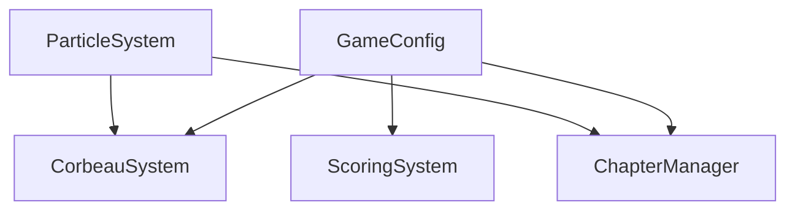

# 🗂️ REGISTRE DES MODULES - VOIR LA VÉRITÉ

## 📋 **SYSTÈME D'IDENTIFICATION**

Format ID : `VDV_[FAMILY]_[NAME]_[NUM]`
- **VDV** = Voir la Vérité
- **FAMILY** = Famille de module (GFX/SYS)
- **NAME** = Nom du module
- **NUM** = Numéro séquentiel (001, 002, etc.)

---

## 🎨 **FAMILLE : GRAPHICS_SYSTEMS**

### **Catégorie : PLAYER_RENDERER**
| ID | Module | Description | Dépendances | Version |
|---|---|---|---|---|
| `VDV_GFX_BOAT_001` | BoatRenderer | Rendu du bateau joueur (normal/militaire) | Aucune | 1.0.0 |

### **Catégorie : BALL_RENDERER**
| ID | Module | Description | Dépendances | Version |
|---|---|---|---|---|
| `VDV_GFX_LANTERN_002` | LanternRenderer | Rendu lanterne magique (actif/inactif) | Aucune | 1.0.0 |

### **Catégorie : PARTICLE_RENDERER**
| ID | Module | Description | Dépendances | Version |
|---|---|---|---|---|
| `VDV_GFX_HEART_003` | HeartRenderer | Rendu cœurs multiples styles | Aucune | 1.0.0 |

### **Catégorie : BACKGROUND_RENDERER**
| ID | Module | Description | Dépendances | Version |
|---|---|---|---|---|
| `VDV_GFX_ENV_004` | EnvironmentRenderer | Rendu environnement (ciel/mer/requins) | Aucune | 1.0.0 |

### **Catégorie : VFX_RENDERER**
| ID | Module | Description | Dépendances | Version |
|---|---|---|---|---|
| `VDV_SYS_PARTICLE_004` | ParticleSystem | Système particules multi-collections | Aucune | 1.0.0 |

---

## ⚙️ **FAMILLE : GAMEPLAY_SYSTEMS**

### **Catégorie : SECRET_MECHANICS**
| ID | Module | Description | Dépendances | Version |
|---|---|---|---|---|
| `VDV_SYS_CORBEAU_001` | CorbeauSystem | Corbeau secret avec transformations | particle-system, game-config | 1.0.0 |

### **Catégorie : PROGRESSION_TRACKING**
| ID | Module | Description | Dépendances | Version |
|---|---|---|---|---|
| `VDV_SYS_SCORING_003` | ScoringSystem | Scoring avancé avec munitions | game-config | 1.0.0 |

---

## 📚 **FAMILLE : NARRATIVE_SYSTEMS**

### **Catégorie : PROGRESSION_MANAGER**
| ID | Module | Description | Dépendances | Version |
|---|---|---|---|---|
| `VDV_SYS_CHAPTER_002` | ChapterManager | Gestionnaire chapitres et transitions | game-config, particle-system | 1.0.0 |

---

## 🔧 **FAMILLE : CONFIG_SYSTEMS**

### **Catégorie : GAME_CONFIG**
| ID | Module | Description | Dépendances | Version |
|---|---|---|---|---|
| `VDV_CFG_GAME_001` | GameConfig | Configuration centrale du jeu | Aucune | 1.0.0 |

---

## 📊 **STATISTIQUES**

- **Total modules** : 9
- **Modules graphiques** : 5
- **Modules gameplay** : 2
- **Modules narratifs** : 1
- **Modules config** : 1

## 🔗 **DÉPENDANCES**



## 🎯 **UTILISATION**

```javascript
// Accès par ID
const boat = ModuleManager.get('graphics', 'boat');
console.log(boat.moduleId); // VDV_GFX_BOAT_001

// Vérification de disponibilité
if (ModuleManager.isAvailable('systems', 'corbeau')) {
    const corbeau = ModuleManager.systems.corbeau;
    console.log(corbeau.family); // GAMEPLAY_SYSTEMS
}
```